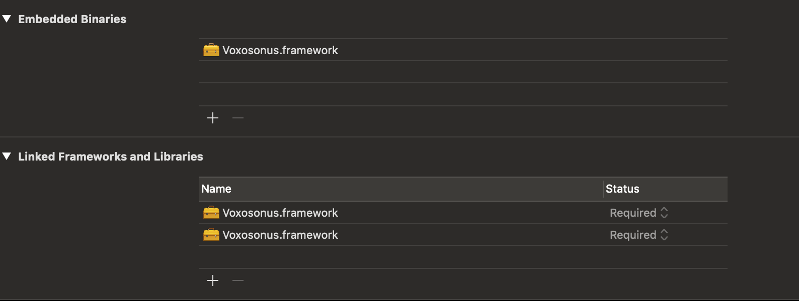

# 
Swift Text-based Machine Learning for humans.


## Requirements
* iOS 12.0+
* Xcode 10+
* Swift 4.2+

It is usable for iOS 11.0+, however the pod and the supplied files have only been tested on the above.

## Author

HeercoGrond, heercogrond@live.nl

## License

Voxosonus is available under the MIT license. See the LICENSE file for more info.

## Installing

### CocoaPods 

[CocoaPods]("https://cocoapods.org/") is a dependency manager for Cocoa projects. For usage and installation instructions, visit their website. To integrate Alamofire into your Xcode project using CocoaPods, specify it in your `Podfile:`

```pod 'Voxosonus', '~> 0.1'``` 

## Why Voxosonus? 

Machine Learning is becoming more commonplace in development, heavy handed tasks that can be offset through a certain trained model or a convolutional neural network that will calculate based on the data it is set to analyze to produce predictions based on what the user has said. However I noticed a distinct lack in applications using the technology while it could offer an interesting solution, mostly because the complexity of the subject is very high.

Voxosonus is meant to lower the bar of entry and make Machine Learning for Swift understandable and implementable through a basic framework that offers users to transfer speech to text and text to a model, even using their own data. It is meant to be flexible and adaptable to a developer's needs, so it is easy for beginners to understand and for advanced developers to extend. As such, all the code is fully open source and can be adapted at will. 

## Usage

To implement the Voxosonus Framework some steps need to be undertaken:

The base of the framework is built for iOS 11.x devices. This means that in order to effectively run the framework and it's code, you should beware that your app is only available on iOS 11.x or higher.

In order to utilize the framework as is with the dataset provided within the framework (as detailed in the `dataset.json,` which is a filtered version of the `WatsonConversationCarWorkspace.json` ) you will need to copy the built version of the framework into your folder and add it to your project alongside defining it as one of the embedded libraries as shown below. 



If you are only interested in the provided version of the framework, see the `Framework` folder. This will for now only be the built version for x64 iPhones.

## Creating your own model

The tools are provided to create your own model in the `./MachineLearningTools` folder. There are two playgrounds there to help you create a dataset that will work with the Voxosonus Framework: 
* CreateVoxosonusModel.playground
* FilterLabeledData.playground

The FilterLabeledData playground is setup to change the json of a IBM Watson workspace to a readable format for the CreateVoxosonusModel playground. Input either file into the resources of the playground and change the variables to load in the specified dataset to either adapt or change. In both cases the results will be saved to your documents. 

If you have created a new model, you can simply replace the existing VoxosonusMLModel file in the project and build a new version of the framework for your intended use or directly replace it in the Framework's folder. It is strongly suggested to do the former, since behaviour can be unpredictable when changing the built framework. 

## Implementation of Framework

The below code is a simple Swift 4.2 implementation on an iOS 12.0 device as shown in the VoxosonusExampleApp added to this project.

```swift
import UIKit
import Voxosonus

// In order to be given an answer as to what data is given, you will need to have your class inherit the VoxosonusDelegate.
class ViewController: UIViewController, VoxosonusDelegate {

    // Initialize the Voxosonus public facing class. This houses all the public available functions for use in your application.
    let model = Voxosonus()
    
    override func viewDidLoad() {
        super.viewDidLoad()
        
        // Set the delegate for the Voxosonus class.
        model.delegate = self;
       
        // You can subscribe tags that will be added and 'listened' to when the framework starts listening to speech.
        model.subscribeTag(tag: Tag(tagname: "decision_replies"))
    }
    
    // An example of the listening of the framework bound to a button.
    @IBAction func startTest(_ sender: Any) {
        model.startListening()
    }
    
    // This function is inherited from the VoxosonusDelegate protocol and will fire once the framework has been done processing and analyzing the spoken sentence. 
    func labelFound(label: Tag) {
        print(label.value)
    }
}
```

## Troubleshooting

### The dataset I've used seems imcompatible.

In the comments of the CreateVoxosonusModel playground is a short description of expected data. Generally if you keep to a structure of a json file with a label and a text field, it will work. An example would be such:

```json
[
    {
        "label": "A label",
        "text": " some text"
    },
    {
        "label": "Another label",
        "text": "some other more relevant text"
    }
]
```

### I've loaded in the framework, however it doesn't seem to work.

Make sure you have done the proper importing, using `import Voxosonus`, then verify the following:

* The framework is properly added as described in the Usage part of this readme.

* You have implemented the `VoxosonusDelegate` and set the `Voxosonus` class' delegate to the file with it.

* You have subscribed a 'Tag' through the model. 

If you have done the following and are still encountering problems, please make an issue in the repository. 
